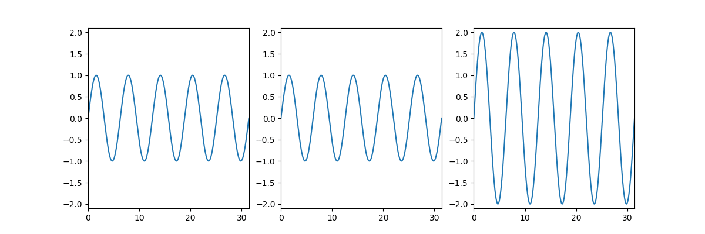

# mpl_gifv

## Make a movie out of matplotlib plots (requires ImageMagick)

## Preliminaries

1. Install [ImageMagick](https://www.imagemagick.org). In Debian/Ubuntu run `apt-get install imagemagick`. For other distros and OSs, see [ImageMagick installation instructions](https://www.imagemagick.org/script/binary-releases.php).

2. To run test.py verify installation of [numpy](http://numpy.org) and [matplotlib](http://matplotlib.org).

3. Put the mpl_gifv folder somewhere in your pythonpath.

## The basic idea:

1. Create a GIF object.

2. Add frames to it by passing matplotlib figure handles to its add function.

3. Call its make function.

## Parameters of `GIF` constructor:

1. Required: `gif_filename`, the output filename.

2. Optional: `fps`, frames per second. Default 30.

3. Optional: `dpi`, dots per inch. Default 100.

4. Optional: `loop`, number of times to loop. Default 0 (loop forever).

## Example

```python
from matplotlib import pyplot as plt
import numpy as np
from mpl_gifv import GIF

f = plt.figure(figsize=(12,4))

mov = GIF('sum_of_sines.gif',fps=30,dpi=100,loop=0)

t = np.linspace(0,10*np.pi,1024)
sig1 = np.sin(t)
xlim = (t.min(),t.max())
ylim = (-2.1,2.1)

for k in range(100):
    
    sig2 = np.sin(t+float(k)/50.0*np.pi)
    sig3 = sig1+sig2

    plt.clf()
    plt.subplot(1,3,1)
    plt.cla()
    plt.plot(t,sig1)
    plt.xlim(xlim)
    plt.ylim(ylim)
    plt.subplot(1,3,2)
    plt.cla()
    plt.plot(t,sig2)
    plt.xlim(xlim)
    plt.ylim(ylim)
    plt.subplot(1,3,3)
    plt.cla()
    plt.plot(t,sig3)
    plt.xlim(xlim)
    plt.ylim(ylim)
    
    plt.pause(.000001)
    mov.add(f)

mov.make()
```

