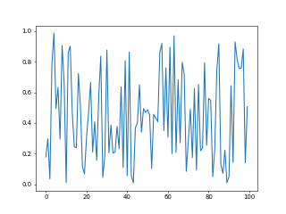

# fig2gif

## Make a movie out of matplotlib plots (requires ImageMagick)

## Preliminaries

1. Install [ImageMagick](https://www.imagemagick.org). In Debian/Ubuntu run `apt-get install imagemagick`. For other distros and OSs, see [ImageMagick installation instructions](https://www.imagemagick.org/script/binary-releases.php).

2. To run tests verify installation of [numpy](http://numpy.org) and [matplotlib](http://matplotlib.org).

3. Put the fig2gif folder somewhere in your pythonpath.

## The basic idea:

1. Create a GIF object.

2. Add frames to it by passing matplotlib figure handles to its add function.

3. Call its make function.

## Parameters of `GIF` constructor:

1. Required: `gif_filename`, the output filename.

2. Optional: `fps`, frames per second. Default 30.

3. Optional: `dpi`, dots per inch. Default 100.

4. Optional: `loop`, number of times to loop. Default 0 (loop forever).

## Minimal Working Example

```python
from matplotlib import pyplot as plt
import numpy as np
from fig2gif import GIF

# create a GIF object, specifying an output filename
mov = GIF('random.gif',fps=10,dpi=50,loop=0)

# create a matplotlib figure
f = plt.figure()

# plot something on it a few times:
for k in range(10):
    # clear the axes:
    plt.cla()
    # make the plot
    plt.plot(np.random.rand(100))
    # add it to the GIF
    mov.add(f)

# make the gif
mov.make()
```



## More Illustrative Example

```python
from matplotlib import pyplot as plt
import numpy as np
from fig2gif import GIF

# create a GIF object, specifying an output filename,
# frames per second (fps), dots per inch (dpi), and
# number of loops (0 being infinite)
mov = GIF('sum_of_sines.gif',fps=10,dpi=100,loop=0)


# create a matplotlib figure on which to draw whatever
# you'd like to make a movie of, along with subplot
# axes
f = plt.figure(figsize=(12,4))
ax1 = f.add_subplot(131)
ax2 = f.add_subplot(132)
ax3 = f.add_subplot(133)

# in this example, we want a three-panel figure
# showing two phase-shifted sine waves and their
# sum
t = np.linspace(0,10*np.pi,1024)
sig1 = np.sin(t)

# set limits to the axes so that they're constant
# across frames
xlim = (t.min(),t.max())
ylim = (-2.1,2.1)
for ax in [ax1,ax2,ax3]:
    ax.set_xlim(xlim)
    ax.set_ylim(ylim)

# plot anything that doesn't change outside of the
# loop; the first sine wave has a constant phase of 0
line1, = ax1.plot(t,sig1)

# the loop needs to know whether the shifted and summed
# waves have ever been drawn before. if they haven't,
# they're plotted with ax.plot; if they have, they're
# updated with ax.set_ydata
started = False

N = 20
for k in range(N):

    # shift phase by k/N cycles:
    sig2 = np.sin(t+float(k)/float(N)*2.0*np.pi)
    sig3 = sig1+sig2

    if not started:
        line2, = ax2.plot(t,sig2)
        line3, = ax3.plot(t,sig3)
        started = True
    else:
        line2.set_ydata(sig2)
        line3.set_ydata(sig3)

    plt.pause(.000001)

    # add each new frame to the GIF object
    mov.add(f)

# make the GIF object
mov.make()
```

